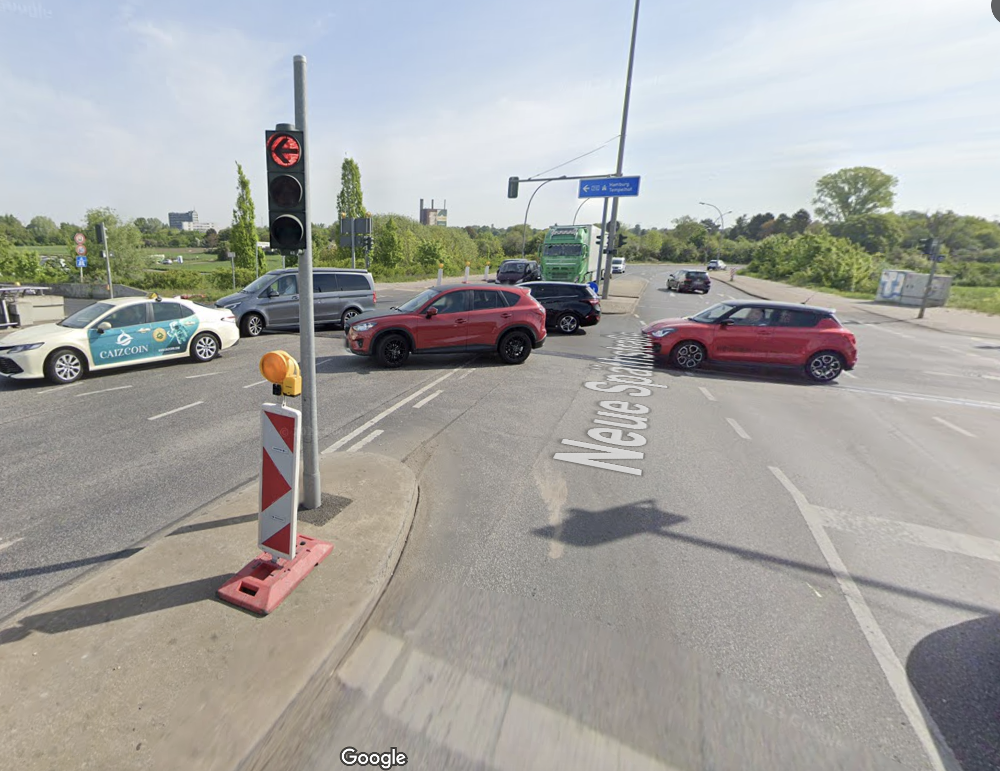

# Driving Mistakes

This repository is personal repo for the most common/repititve mistakes I did during driving lessons.

## San Andrew :
    
| Front | Back |
|---------|---------|
|  |  |
|  | |
|  |  |

## Right Before Left:

- https://maps.app.goo.gl/BXXP9vbp8uEmbQzK6
  
- https://maps.app.goo.gl/4fuHH7pTfGWDhPCi7
  

## Look Right for Cyclists first:

- https://maps.app.goo.gl/GUYz6Chj4sie9eHg9
  

## The road is narrowing down - Road is widening up:

- https://maps.app.goo.gl/V9neNE8Td3g7HdqM8 - https://maps.app.goo.gl/PWDngCxh78NdUhLD6
  
| Narrowing Down | Widening Up |
|---------|---------|
|  |  |
|  |  |

## There's only Bus road - Never walk on it:

## Autobahn Exit:

## Priority Order:

Focus only on the cars coming from the front.

## Safety Distance:

- All safety distances: https://youtu.be/OtUmt6weMVU?si=Y3fzYG2Z3oXBt2Eg
- 1-2 in Arabic: https://www.youtube.com/watch?v=lrwjf0YpveI

## Traps

Neukolln traffic light trap.

Neukolln traffic light

Mac Lane

Right Before Left Road Work

School Speed 30

## Stop For Coming Car

## Autobahn

- Identify the gap from far place, always enter early.

## Expected Questions

- Warnblinker (SUPA):
  - Stau - Car not stable
  - Unfall - Acciedent
  - Panne - Car error
  - Abschleppen - Car wil pick it up
- Nebelscheinwerfer - [More info](https://www.frag-den-fahrlehrer.de/2017/11/13/nebelscheinwerfer-und-nebelschlussleuchte/):
  - 50 meters
  - Regen (rain)
  - Nebel (fog)
  - Schnee (snow)
- Profiltiefe : 1.6 mm
- Reifendruck

- Sommerreifen/Winterreifen
- Hupe - Horn
- Under the car hood

- https://youtu.be/ew1ely6qFb4

## General Notes:
- Keep the indicator open when turning right or left on long lanes.
- Go always to **the right** lane because you're a driving school.
- If you don't have priority (Triangle Shape): 
  - It's preferrable to go **straight** without turning little right.
  - If you need to go to little right to have a viewing point then look mirror, side mirror, side window before doing this small turn.
  - Then Look Left, Then right, Then left again, then right and move.
- Always wait for people:
  - If there are children slow down.
  - If there's someone going from their cars, slow down or change lanes.
- At traffic light:
  - If you're moving left:
    - If there are cars in front of you and you're moving to the left. Wait until they all go or go when you have the green light.
    - If 3 Cars were waiting in front of you, don't pass the traffic light. It'll be yellow and you shouldn't wait on passengers path.
- On Autobahn:
  - **Never** pass the car on the left.
- At 30 zones:
  - Right before left.
  - If the right road is narrow, Stop or walk very very slow.
  - If no priority go to the viewing point straight.
- Pass the cycle if there's space and no one before you.
- Inside city conditional 30 will most of times be from 7h to 17h. Try To confirm that with your eyes.
- Outside city conditional 30 will be most of times be from 22h to 6h so speed will be 50.
- Stay on the right side always.
- The handler (Car Opener) should be over the sidewalk completely when parking between 2 cars.
- Look straight when parking to know if you're straight.
- Stop before auto bahn exit on the traffic light not on the turning point.
- In priority road/fast road expect that all are priority.
- Don't slow down before changing the lanes.
- If there's a bus:
  - Slow down when passing it
  - If it has the blinker open either wait or change the lane

## Exam Map

